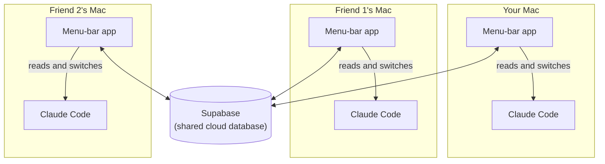
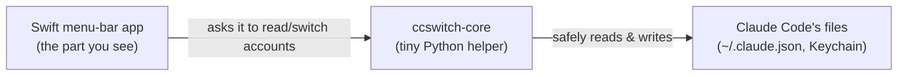
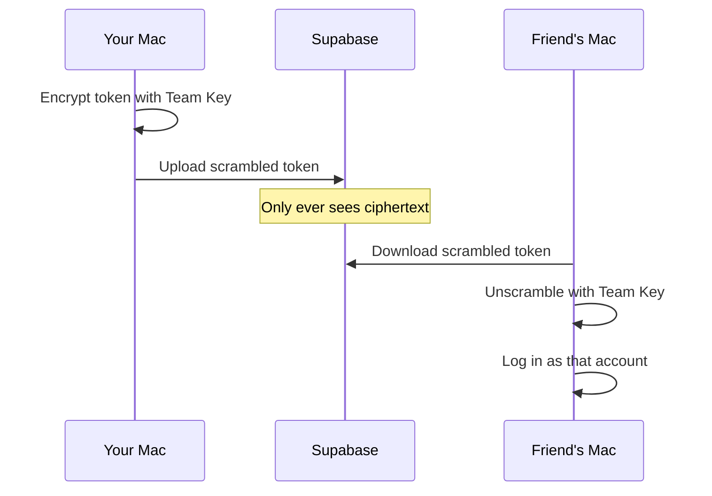
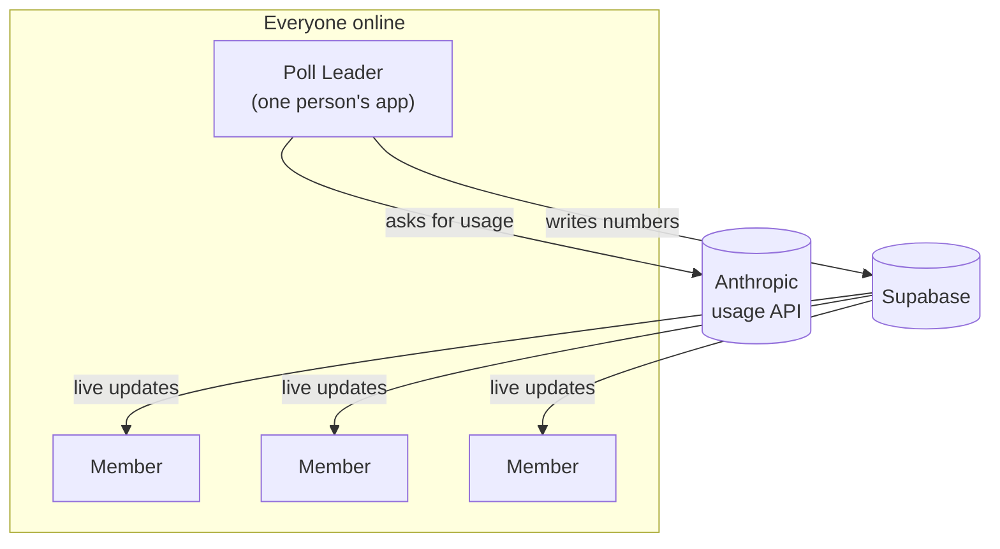
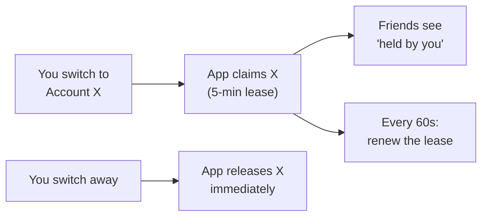
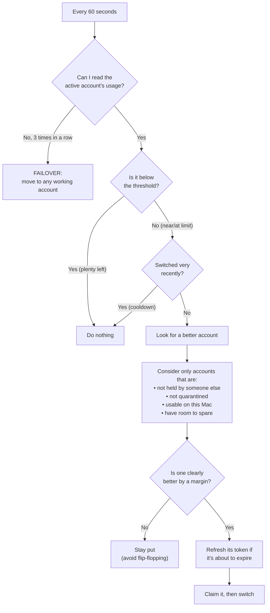

# Claude Code Switcher

A little macOS menu-bar app that lets a small group of friends (up to ~10)
**share a pool of Claude accounts** and always end up working on whichever one
has usage left — automatically, without stepping on each other.

This document explains, in plain language, **how the whole thing actually
works**: how you sign in, how it runs on your Mac, how it syncs over the
internet, how several people on several computers stay coordinated, how your
accounts are kept private, and exactly what rules the auto-switcher follows.

---

## 1. The one-paragraph version

Each person runs the app on their own Mac. The app knows which Claude accounts
you're logged into locally, and it talks to a shared cloud database
(Supabase) so everyone sees the same pool of accounts and their live usage.
When your current account gets close to its limit, the app switches you to the
account with the most room left — but never to an account a friend is actively
using right now. Account passwords (tokens) are **encrypted on your Mac before
they ever leave it**, using a key only your team has, so the cloud only ever
stores scrambled data.

---

## 2. The big picture



- Everyone runs their **own copy** of the app.
- The **cloud** is just a shared noticeboard: which accounts exist, how much
  each has been used, and who's currently using which one.
- Each app **only touches Claude Code on its own Mac** — it never reaches into
  anyone else's computer.

---

## 3. What's on your Mac: two small programs

The app is actually two pieces working together:



- **The Swift app** is the menu-bar dropdown. It makes all the decisions, draws
  the UI, talks to the cloud, and does the encryption.
- **`ccswitch-core`** is a tiny Python helper that is the *only* thing allowed
  to touch Claude Code's actual login files. The app calls it for one job at a
  time ("what's logged in?", "switch to this account", "read this account's
  usage") and it answers, then exits.

**Why split it in two?** All the delicate credential handling lives in one
small, auditable place. And when it writes to Claude Code's files, it uses the
**same locking that Claude Code itself uses**, so it can never corrupt your
login even if Claude Code is refreshing its token at the same moment.

---

## 4. Signing in and joining a team

You sign in with your **email** — no password. Supabase emails you a link; you
click it, and because the app registers a `ccswitch://` link on your Mac, the
click opens the app and you're signed in.

Then one of two things happens:


- **The first person creates the team.** The app generates a **Team Key** (a
  secret encryption key) and shows it to them once.
- **Everyone else joins** using two things, handed to them privately by a
  teammate (text, Slack, in person — the app doesn't send these for you):
  1. an **invite code** (proves you're allowed onto the team), and
  2. the **Team Key** (lets your Mac unscramble shared account tokens).

Two different secrets on purpose — one gets you *into* the team, the other lets
you *decrypt* shared logins.

---

## 5. How accounts get shared across computers

When you "Add current account," the app records whatever Claude account you're
logged into. If your team pool is set up, you choose how to share it:

| Share mode | What the cloud stores | Who can switch to it |
|---|---|---|
| **Shared** | The login token, **encrypted** with the Team Key | Anyone on the team |
| **Visibility-only** | Just the usage numbers — **no token** | Only you, on your own Mac |

So "visibility-only" means: *my friends can see how much of this account I've
used, but they can't log in as me.* "Shared" means: *anyone on the team can
actually switch onto this account* — because the encrypted token is in the
cloud and every teammate's Mac has the Team Key to unscramble it.



---

## 6. How your accounts stay private

This is the important part.

- **The Team Key never leaves your devices.** It's stored in each Mac's
  **Keychain** and is never uploaded to the cloud. The cloud literally cannot
  read your shared tokens, because it doesn't have the key.
- **Tokens are encrypted before they leave your Mac** (using ChaCha20-Poly1305,
  a modern, strong cipher). The cloud only ever holds scrambled bytes.
- **Plaintext tokens only exist briefly, in memory, on the Mac that's using
  them.** They're passed to the Python helper through a private channel — never
  written to a log, never put in a place other programs could read.
- **The cloud enforces team boundaries itself.** Every piece of data is behind
  row-level security rules, so even a leaked read-only cloud key can only ever
  see *your own team's* rows, and only the owner of an account can change how
  it's shared.

Put simply: **a friend can use a shared account, but nobody — not the cloud,
not a stranger — can read the raw login unless they're on your team and have
the Team Key.**

---

## 7. How usage limits are tracked

Claude accounts have two rolling limits the app cares about:

- a **5-hour** window, and
- a **7-day** window.

The app always looks at whichever one is **tighter** (closer to full) — if your
7-day is at 82% and your 5-hour at 30%, the app treats that account as "82%
used," because 82% is what will actually stop you first.

### The "poll leader" — why adding people doesn't spam the API

Someone has to actually ask Anthropic "how much has this account used?" But if
all 10 of you asked, constantly, you'd hammer the usage API and get
rate-limited. So the team **elects a single poll leader**:



- **Only the leader talks to Anthropic.** Everyone else gets the numbers
  instantly from the cloud (live updates, no polling).
- If the leader's app quits or its computer sleeps, **someone else
  automatically takes over** within about a minute and a half.
- The leader doesn't poll on a dumb fixed timer — it uses an **adaptive
  schedule**: it checks a busy account more often, backs off on a quiet one,
  speeds up when an account is near its limit, and slows down after getting
  rate-limited. Target: about **one check every 3 minutes per account**, which
  stays comfortably under Anthropic's limit no matter how many people join.

> One exception: a **visibility-only** account can only be read by its owner
> (nobody else has its token), so its usage always comes from the owner's own
> app, whoever the leader happens to be.

---

## 8. Claims — no two people on the same account at once

Before anyone uses a shared account, their app **claims** it — like putting a
sticky note on it that says "in use." Everyone else sees a *"held by ______"*
badge and knows to pick a different one.



- A claim is a **5-minute lease**, renewed every 60 seconds while you're on it.
- If your app crashes or your Mac sleeps, the lease simply **expires on its
  own** — the account frees up automatically, no cleanup needed.
- When you switch **away** from an account, its claim is **released right away**,
  so a teammate can grab it immediately.

---

## 9. The auto-switch algorithm (the heart of it)

You can turn on **Auto-switch**. When it's on, the app checks your active
account **once a minute** and decides whether to move you. Here's the exact
logic:



The rules in words:

- **Threshold** — the app only considers switching once your active account
  crosses a usage line you set (**80 / 90 / 95 / 98%**, default **90%**).
- **Pick the most headroom** — among eligible accounts, it goes to the one with
  the most room left.
- **Never poach** — an account another teammate is actively using is *never* a
  target. Full stop.
- **Hysteresis (anti-flip-flop)** — a candidate has to be better by a real
  **margin (10%)**, and switching to it must actually leave you healthy.
  This stops two accounts hovering at the line from bouncing you back and forth.
- **Cooldown** — after a switch, it waits **5 minutes** before doing another
  routine one (an account hitting a hard wall can override this).
- **Freshen before switching** — if the account you're about to move to has a
  token expiring in the next 10 minutes, it's refreshed first, so you don't
  land on a dead login.
- **Quarantine** — if an account's login is truly broken, it's set aside and
  skipped. It's **automatically un-quarantined the moment someone logs into that
  account again** (the app notices the login is genuinely new).

You'll get a small notification when the app switches you, quarantines an
account, or when everything is maxed out.

### Manual switching

You're never locked out of driving it yourself:

- **Click any account** in the list to switch to it right now.
- **"Switch to best account"** — one click, jump to whoever has the most room.
- **"Rotate to next account"** — cycle to the next one in the list.

Manual actions ignore the threshold/cooldown — if *you* ask, it just does it.

---

## 10. Who used how much (attribution)

Anthropic's usage is measured **per account, not per person**, so the app can't
directly tell how much *you* personally used a shared account. Instead — only if
you opt in — it installs a tiny Claude Code hook that logs **one line every time
you send a prompt** (a timestamp and which account was active — *never* your
prompt's contents). The **Team usage** window then shows, over the last 7 days,
how many prompts each person sent and their rough share of the pool.

This is **off by default** and turned on with a clearly-labeled toggle.

---

## 11. Quick reference: the key numbers

| Thing | Value |
|---|---|
| Usage windows watched | 5-hour and 7-day (tighter one wins) |
| Auto-switch threshold | 80 / 90 / 95 / 98% (default 90%) |
| Anti-flip-flop margin | 10% |
| Cooldown between routine switches | 5 minutes |
| Auto-switch check interval | every 60 seconds |
| Reads before declaring "failover" | 3 in a row |
| Token "about to expire" buffer | 10 minutes |
| Account claim lease / renewal | 5 min lease, renewed every 60s |
| Poll-leader takeover time | ~90 seconds |
| Usage-check pace per account | ~1 every 3 minutes (adaptive) |

---

## 12. Building and running it (macOS)

You need [Swift](https://www.swift.org/) and [uv](https://docs.astral.sh/uv/)
installed.

```bash
# Build the app bundle (compiles the Swift app + wraps it as a real .app)
./app/scripts/build_app_bundle.sh

# Launch it
open app/.build/ClaudeCodeSwitcher.app
```

The app appears as an icon in your menu bar (no Dock icon). Click it to open the
panel. The cloud side (Supabase database) is described in
[`supabase/README.md`](supabase/README.md).

---

## 13. An honest heads-up

Pooling one Claude subscription across several people and computers cuts against
Anthropic's consumer terms, and the bigger the group, the more it can look
unusual to their systems. This app is upfront about that and does **nothing** to
hide or disguise it — use it with people you trust to accept that together. This
notice is shown right in the app's sign-in screen too, not buried here.
