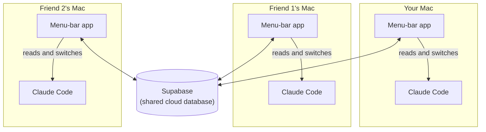
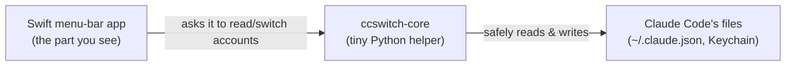
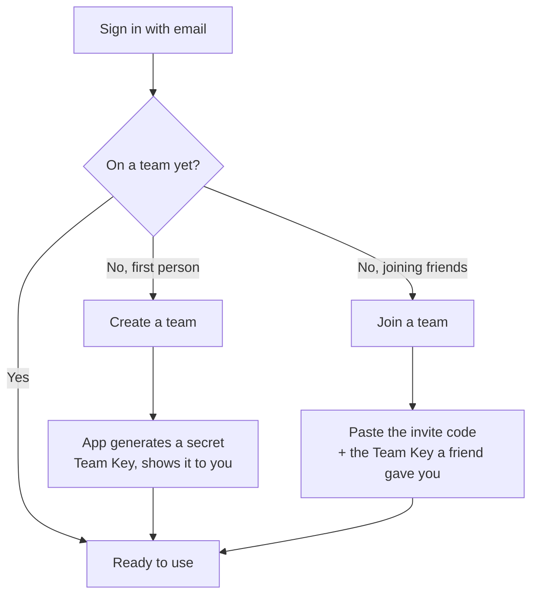
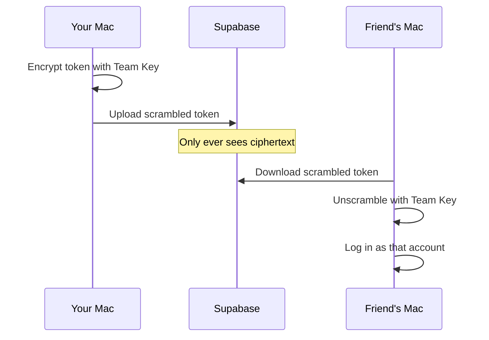
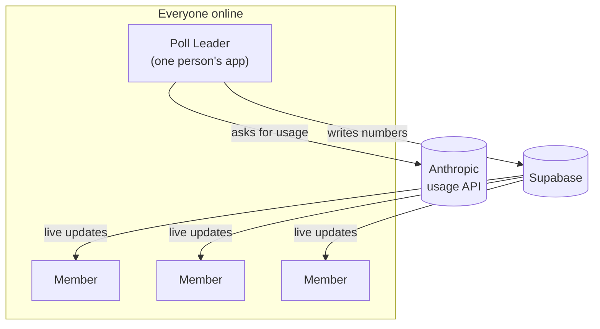
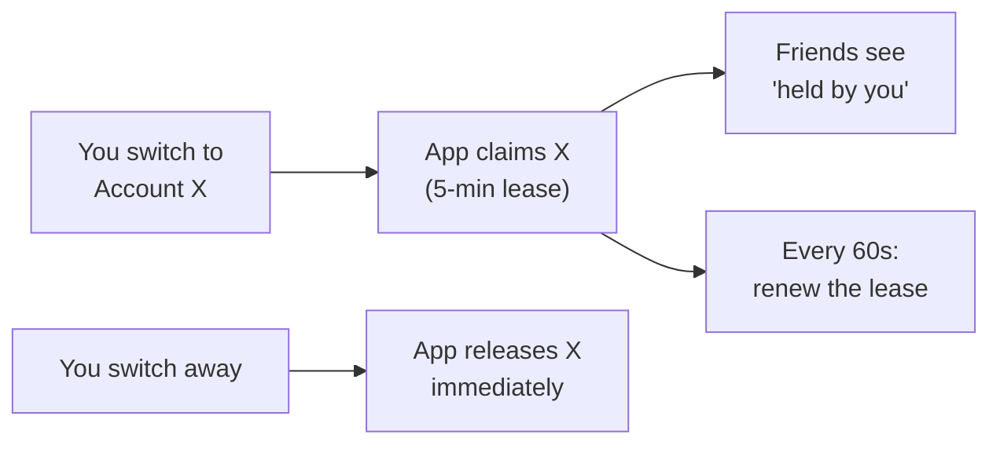
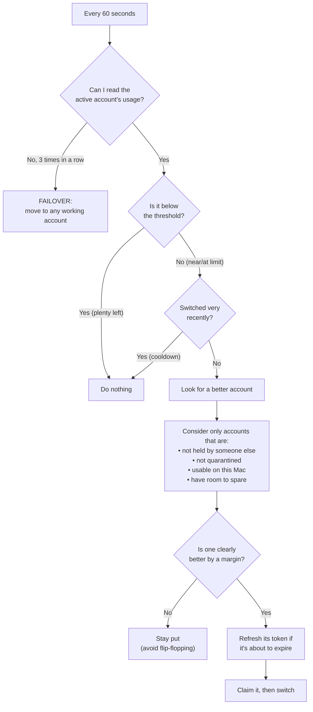

# Claude Code Switcher

A macOS menu-bar app that lets a small group (up to ~10) **share a pool of
Claude accounts**, always landing on whichever one still has usage left, without
stepping on each other.

This explains how it works: signing in, what runs on your Mac, how it syncs, how
several people stay coordinated, how your accounts stay private, and the exact
rules the auto-switcher follows.

---

## 1. The one-paragraph version

Each person runs the app on their own Mac. The app knows which Claude accounts
you're logged into locally, and it talks to a shared cloud database
(Supabase) so everyone sees the same pool of accounts and their live usage.
When your current account gets close to its limit, the app switches you to the
one with the most room left, and never to an account a teammate has reserved.
Login tokens are **encrypted on your Mac before they leave it**, with a key only
your team holds, so the cloud only ever stores scrambled data.

---

## 2. The big picture



- Everyone runs their **own copy** of the app.
- The **cloud** is just a shared noticeboard: which accounts exist, how much
  each has been used, and who's currently using which one.
- Each app **only touches Claude Code on its own Mac**. It never reaches into
  anyone else's computer.

---

## 3. What's on your Mac: two small programs

The app is actually two pieces working together:



- **The Swift app** is the menu-bar dropdown. It makes all the decisions, draws
  the UI, talks to the cloud, and does the encryption.
- **`ccswitch-core`** is a small Python helper, the *only* thing allowed to
  touch Claude Code's login files. The app calls it for one job at a time
  ("what's logged in?", "switch to this account", "read this account's usage").
  It answers, then exits.

**Why split it in two?** All the delicate credential handling lives in one
small, auditable place. And when it writes to Claude Code's files, it uses the
**same locking that Claude Code itself uses**, so it can never corrupt your
login even if Claude Code is refreshing its token at the same moment.

---

## 4. Signing in and joining a team

You sign in with your **email**, no password. Supabase emails you a **6-digit
code**; you type it into the panel and you're in.

Then one of two things happens:



- **The first person creates the team.** The app generates a **Team Key** (a
  secret encryption key) and shows it to them once.
- **Everyone else joins** with two things, handed over privately by a teammate
  (text, Slack, in person; the app doesn't send these for you):
  1. an **invite code**, which proves you're allowed onto the team, and
  2. the **Team Key**, which lets your Mac unscramble shared account tokens.

Two separate secrets on purpose: one gets you *into* the team, the other lets you
*decrypt* shared logins.

Signing in itself is open to anyone, but creating or joining a team needs the
app's admin to grant that account access first (see `admin/README.md`). If
you sign in before that happens, you'll see a "waiting for approval" screen
instead of the create/join forms.

---

## 5. How accounts get shared across computers

When you "Add current account," the app records whatever Claude account you're
logged into. If your team pool is set up, you choose how to share it:

| Share mode | What the cloud stores | Who can switch to it |
|---|---|---|
| **Shared** | The login token, **encrypted** with the Team Key | Anyone on the team |
| **Visibility only** | Just the usage numbers, **no token** | Only you, on your own Mac |

"Visibility only" means teammates can see how much of the account you've used but
can't log in as you. "Shared" means anyone on the team can switch onto it, since
the encrypted token is in the cloud and every teammate's Mac has the Team Key.



---

## 6. How your accounts stay private

This is the important part.

- **The Team Key never leaves your devices.** It's stored in each Mac's
  **Keychain** and is never uploaded to the cloud. The cloud literally cannot
  read your shared tokens, because it doesn't have the key.
- **Tokens are encrypted before they leave your Mac** (using ChaCha20-Poly1305,
  a modern, strong cipher). The cloud only ever holds scrambled bytes.
- **Plaintext tokens exist only briefly, in memory, on the Mac using them.**
  They reach the Python helper over stdin, never a log file and never a command
  argument other processes could read.
- **Machine-local secrets never travel.** Claude Code keeps MCP server logins and
  plugin secrets in the same file as your account token; the helper strips those
  out before anything is stored or uploaded, so sharing an account shares only
  the account.
- **The cloud enforces team boundaries itself.** Every piece of data is behind
  row-level security rules, so even a leaked read-only cloud key can only ever
  see *your own team's* rows, and only the owner of an account can change how
  it's shared.

Put simply: **a teammate can use a shared account, but nobody, not the cloud and
not a stranger, can read the raw login without being on your team and holding the
Team Key.**

---

## 7. How usage limits are tracked

Claude accounts have two rolling limits the app cares about:

- a **5-hour** window, and
- a **7-day** window.

The app always uses whichever is **tighter**. If your 7-day is at 82% and your
5-hour at 30%, the account counts as "82% used", because 82% is what stops you
first.

### The poll leader, or why adding people doesn't spam the API

Someone has to ask Anthropic "how much has this account used?". If all 10 of you
asked constantly you'd hammer the usage API and get rate-limited, so the team
**elects a single poll leader**:



- **Only the leader talks to Anthropic.** Everyone else gets the numbers from
  the cloud as live updates, with no polling.
- If the leader's app quits or its Mac sleeps, **someone else takes over** within
  about 90 seconds.
- The leader uses an **adaptive schedule** rather than a fixed timer: more often
  for a busy account, backing off on a quiet one, faster near a limit, slower
  after a rate-limit. It targets about **one check every 3 minutes per account**,
  which stays under Anthropic's limit no matter how many people join.

> One exception: a **visibility-only** account can only be read by its owner,
> since nobody else has its token. Its usage always comes from the owner's own
> app, whoever the leader happens to be.

---

## 8. Reservations (optional)

By default, **nothing is reserved**: two people can use the same account at the
same time, which is usually fine.

If you turn on **"Reserve my accounts while I'm using them"** (Settings → Team),
your app puts a lease on an account you own while you're on it. Everyone else
sees a *"held by ______"* badge, can't switch to it, and auto-switch steers
around it. You can only ever reserve accounts **you own**, never a teammate's,
but an existing reservation is respected by everyone regardless of their own
setting.



- A reservation is a **5-minute lease**, renewed every 60 seconds while you're
  on it.
- If your app crashes or your Mac sleeps, the lease **expires on its own** and
  the account frees up. No cleanup needed.
- Switching **away** releases it immediately, so a teammate can take it at once.

---

## 9. The auto-switch algorithm (the heart of it)

You can turn on **Auto-switch**. When it's on, the app checks your active
account **once a minute** and decides whether to move you. Here's the exact
logic:



The rules in words:

- **Threshold.** It only considers switching once your active account crosses a
  line you set: **80 / 90 / 95 / 98%**, default **90%**.
- **Most headroom wins.** Among eligible accounts it takes the one with the most
  room left.
- **Never poach.** An account a teammate has reserved is never a target.
- **Anti-flip-flop margin.** A candidate must be better by a real **10% margin**
  and must leave you healthy, so two accounts hovering at the line can't bounce
  you back and forth.
- **Cooldown.** After a switch it waits **5 minutes** before another routine one.
  An account hitting a hard wall overrides this.
- **Freshen first.** If the account you're moving to has a token expiring within
  10 minutes, it's refreshed before the switch, so you don't land on a dead
  login.
- **Quarantine.** A truly broken login is set aside and skipped, then released
  **the moment someone logs into that account again**, which the app detects.

You'll get a small notification when the app switches you, quarantines an
account, or when everything is maxed out.

### Manual switching

You're never locked out of driving it yourself:

- **Click any account** in the list to switch to it right now.
- **"Switch to best account"**: one click, jump to whichever has the most room.
- **"Rotate to next account"**: cycle to the next one in the list, ignoring usage.

Manual actions ignore the threshold and cooldown. If you ask, it just does it.

---

## 10. Who used how much (attribution)

Anthropic measures usage **per account, not per person**, so the app can't tell
directly how much you personally used a shared account. If you opt in, it
installs a small Claude Code hook that logs **one line per prompt you send**: a
timestamp and which account was active, never the prompt's contents. The **Team
usage** pane in Settings then shows, over the last 7 days, how many prompts each
person sent and their rough share of the pool.

**Off by default**, enabled with a clearly labelled toggle.

---

## 11. Quick reference: the key numbers

| Thing | Value |
|---|---|
| Usage windows watched | 5-hour and 7-day (tighter one wins) |
| Auto-switch threshold | 80 / 90 / 95 / 98% (default 90%) |
| Anti-flip-flop margin | 10% |
| Cooldown between routine switches | 5 minutes |
| Auto-switch check interval | every 60 seconds |
| Reads before declaring "failover" | 3 in a row |
| Token "about to expire" buffer | 10 minutes |
| Reservation lease / renewal | 5 min lease, renewed every 60s (opt-in) |
| Poll-leader takeover time | ~90 seconds |
| Usage-check pace per account | ~1 every 3 minutes (adaptive) |

---

## 12. Building and running it (macOS)

You need [Swift](https://www.swift.org/) and [uv](https://docs.astral.sh/uv/)
installed.

```bash
# Build the app bundle (compiles the Swift app + wraps it as a real .app)
./app/scripts/build_app_bundle.sh

# Launch it
open app/.build/ClaudeCodeSwitcher.app
```

The app appears as an icon in your menu bar (no Dock icon). Click it to open the
panel. The cloud side (Supabase database) is described in
[`supabase/README.md`](supabase/README.md), and the admin dashboard for
granting online access and tracking signups is described in
[`admin/README.md`](admin/README.md).

---

## 13. An honest heads-up

Pooling one Claude subscription across several people and computers goes against
Anthropic's consumer terms, and the bigger the group, the more it stands out to
their systems. This app is upfront about that and does **nothing** to hide or
disguise it. Use it with people you trust to accept that together. The same
notice appears on the app's sign-in screen, not just here.
